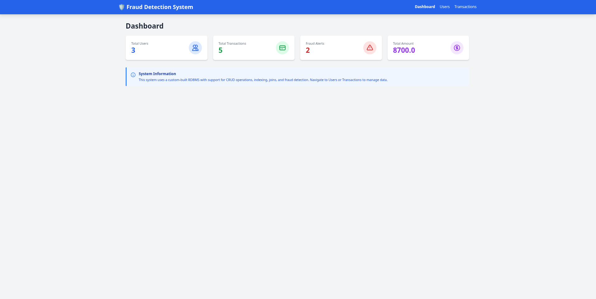
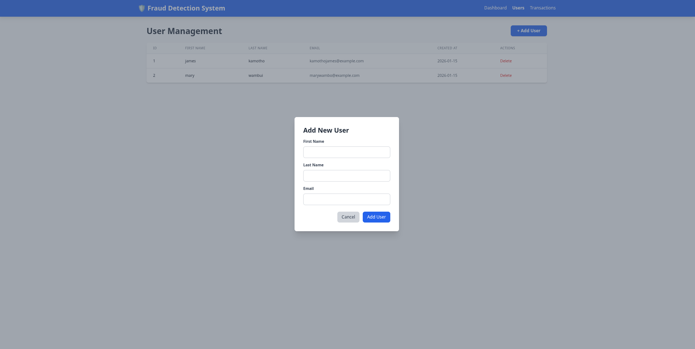
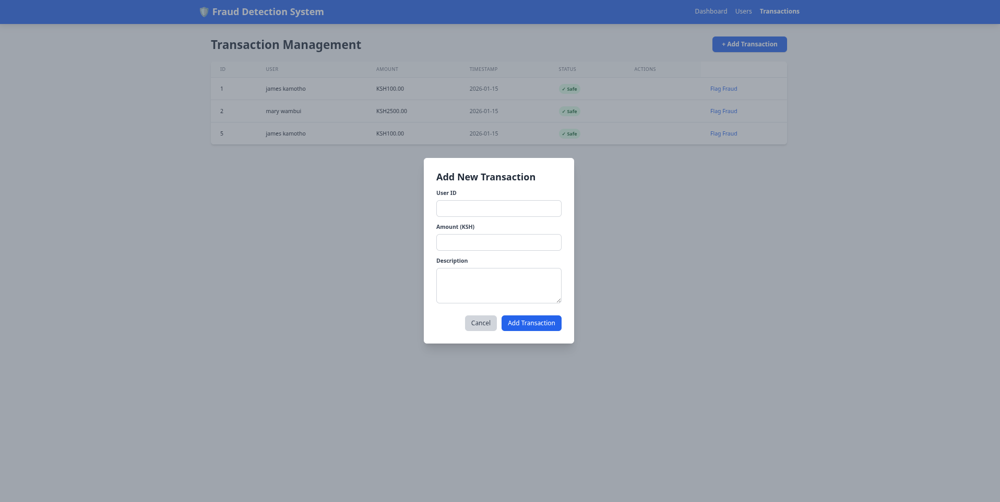

# Relational_database# Simple Relational Database Management System (RDBMS)

A fully functional relational database management system built from scratch in Python, featuring SQL-like syntax, CRUD operations, indexing, joins, and a fraud detection web application demo.

---

##  Project Overview

This project implements a custom RDBMS without using existing database engines like PostgreSQL or SQLite. It demonstrates core database concepts including:

- **Table management** with typed columns
- **CRUD operations** (Create, Read, Update, Delete)
- **Indexing** using hash maps for fast lookups
- **Primary key and unique constraints**
- **INNER JOIN** operations
- **SQL-like query interface**
- **Interactive REPL** (Read-Eval-Print Loop)
- **Web application** with fraud detection system

---

##  Project Structure
```
relational_database/
├── transaction_database.py    # Core RDBMS implementation
│   ├── DataType (Enum)         # Supported data types (INT, TEXT, FLOAT, BOOL)
│   ├── Column                  # Column definition with constraints
│   ├── Table                   # Table with rows, indexes, and operations
│   └── Database                # Database container with multiple tables
│
├── cli.py                      # Interactive REPL interface
│   └── REPL class              # Command-line SQL-like interface
│
├── app.py                      # Flask web application
│   └── Routes for users & transactions management
│
├── templates/                  # HTML templates (Tailwind CSS)
│   ├── index.html              # Dashboard with statistics
│   ├── users.html              # User management (CRUD)
│   └── transactions.html       # Transaction management with JOIN
│
├── webapp.db                   # Persistent database file (pickle format)
│
├── test_database.py            # Unit tests for basic operations
├── test_query.py               # Tests for SELECT queries
├── test_update_delete.py       # Tests for UPDATE and DELETE
├── test_joins.py               # Tests for JOIN operations
│
└── README.md                   # This file
```

---

##  Features

### 1. Core Database Engine (`transaction_database.py`)

#### Data Types
- `INT` - Integer numbers
- `TEXT` - String values
- `FLOAT` - Decimal numbers
- `BOOL` - Boolean values (True/False)

#### Constraints
- **Primary Key** - Unique identifier with automatic indexing
- **Unique** - Ensures column values are unique
- **Not Null** - Prevents NULL values

#### Operations
- **CREATE TABLE** - Define tables with columns and constraints
- **INSERT** - Add rows with automatic constraint validation
- **SELECT** - Query with optional WHERE filtering
- **UPDATE** - Modify existing rows with condition matching
- **DELETE** - Remove rows based on conditions
- **JOIN** - INNER JOIN with optimized index-based algorithm

#### Indexing
- **Hash-based indexes** for O(1) primary key lookups
- **Unique constraint indexes** for fast validation
- Automatic index maintenance on INSERT, UPDATE, DELETE

---

##  Installation & Setup

### Prerequisites
```bash
# Python 3.8+
python --version

# Create virtual environment
python -m venv testenv
source testenv/bin/activate  # On Windows: testenv\Scripts\activate

# Install dependencies
pip i -r requirements.txt
```

### Database Initialization
The database is automatically created with sample data on first run.

---

##  Usage

### 1. Interactive REPL Mode

Start the command-line interface:
```bash
python cli.py
```

**Example Commands:**
```sql
-- Create a table
Jumanji> CREATE TABLE users (id INT PRIMARY KEY, name TEXT NOT NULL, email TEXT UNIQUE, age INT)

-- Insert data
Jumanji> INSERT INTO users VALUES (1, 'Alice', 'alice@example.com', 30)

-- Query all rows
Jumanji> SELECT * FROM users

-- Query with filtering
Jumanji> SELECT * FROM users WHERE age > 25

-- Update rows
Jumanji> UPDATE users SET age = 31 WHERE id = 1

-- Delete rows
Jumanji> DELETE FROM users WHERE age < 20

-- Show all tables
Jumanji> SHOW TABLES

-- Describe table structure
Jumanji> DESCRIBE users

-- Exit
Jumanji> EXIT
```

**Available Commands:**
- `CREATE TABLE <name> (<columns>)` - Create new table
- `INSERT INTO <table> VALUES (...)` - Insert row
- `SELECT * FROM <table> [WHERE <condition>]` - Query rows
- `UPDATE <table> SET <assignments> WHERE <condition>` - Update rows
- `DELETE FROM <table> WHERE <condition>` - Delete rows
- `DROP TABLE <table>` - Remove table
- `SHOW TABLES` - List all tables
- `DESCRIBE <table>` - Show table structure
- `HELP` - Display help
- `EXIT` - Quit REPL

---

### 2. Web Application

Start the Flask web server:
```bash
python app.py
```

Then open your browser to: **http://127.0.0.1:5000**

#### Web App Features:
## Stack

- **Backend:** Flask (Python web framework)
- **Frontend:** HTML5 + Tailwind CSS (via CDN)
- **Database:** Custom RDBMS (this project!)
- **Persistence:** Python pickle format
- **API:** RESTful JSON endpoints

**API Endpoints:**

| Method | Endpoint | Description |
|--------|----------|-------------|
| GET | `/` | Dashboard with statistics |
| GET | `/users` | List all users |
| POST | `/add/user` | Create new user |
| POST | `/users/delete/<id>` | Delete user by ID |
| GET | `/transactions` | List transactions (with JOIN) |
| POST | `/transactions/add` | Create new transaction |
| POST | `/transactions/flag/<id>` | Toggle fraud status |
| GET | `/api/stats` | Get statistics as JSON |

---

**Dashboard (`/`)**
- Total users count
- Total transactions count
- Fraud alerts count
- Total transaction amount

**Users Management (`/users`)**
- View all users (with JOIN to show full names)
- Add new users (first name, last name, email)
- Delete users
- Auto-generated IDs with primary key enforcement
- Email uniqueness validation

**Transactions Management (`/transactions`)**
- View all transactions with user names (INNER JOIN demonstration)
- Add transactions with user dropdown selection
- Automatic fraud detection (flags transactions > $3,000)
- Toggle fraud status manually
- Timestamp tracking

---
## Screenshots





##  Testing

Run the test suites:
```bash
# Test basic operations (CREATE, INSERT, SELECT)
python test_database.py

# Test query filtering (WHERE clauses)
python test_query.py

# Test UPDATE and DELETE operations
python test_update_delete.py

# Test JOIN operations
python test_joins.py
```

**Test Coverage:**
- ✅ Table creation with constraints
- ✅ Primary key enforcement
- ✅ Unique constraint validation
- ✅ NOT NULL constraint validation
- ✅ Data type validation
- ✅ CRUD operations
- ✅ WHERE clause filtering (=, !=, <, >, <=, >=)
- ✅ Logical operators (AND, OR)
- ✅ Index-based lookups
- ✅ INNER JOIN (nested loop and optimized)
- ✅ Multi-table JOINs

---

##  Architecture

### Storage Engine
- **In-memory storage** with pickle-based persistence
- **Row-oriented** storage (list of dictionaries)
- **Schema validation** on every insert/update
- **Automatic constraint checking**

### Indexing Strategy
```python
# Primary key index: O(1) lookup
primary_key_index = {
    1: 0,  # pk_value -> row_index
    2: 1,
    3: 2
}

# Unique constraint index: O(1) uniqueness check
unique_indexes = {
    'email': {'alice@example.com', 'bob@example.com'}
}
```

### Query Execution

**SELECT without WHERE:**
```python
# O(n) - Linear scan
def select_all():
    return self.rows.copy()
```

**SELECT with WHERE:**
```python
# O(n) - Filter with lambda condition
def select_where(condition):
    return [row for row in self.rows if condition(row)]
```

**SELECT by Primary Key:**
```python
# O(1) - Hash index lookup
def get_by_primary_key(pk_value):
    row_index = self.primary_key_index[pk_value]
    return self.rows[row_index]
```

**INNER JOIN:**
```python
# Nested Loop Join: O(n × m)
for left_row in left_table:
    for right_row in right_table:
        if left_row[col] == right_row[col]:
            yield merged_row

# Index-Optimized Join: O(n) when joining on primary key
for left_row in left_table:
    right_row = right_table.get_by_primary_key(left_row[join_col])
    if right_row:
        yield merged_row
```
